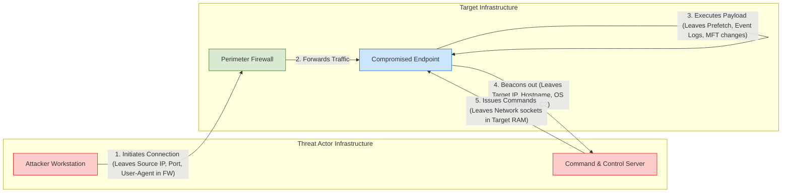

# Locard's Exchange Principle in Digital Environments

## 1. Overview

Locard's Exchange Principle is the foundational axiom of all forensic science. Formulated by Dr. Edmond Locard in the early 20th century, the principle dictates that **"every contact leaves a trace."**

In physical forensics, this means a perpetrator brings trace evidence (hair, fiber, soil) to a crime scene and takes trace evidence away from it. In Digital Forensics and Incident Response (DFIR), this principle states that any interaction between a subject (a user, an attacker, a process, or a piece of malware) and a digital object (an operating system, a network, a file system, or a device) results in the deterministic exchange of digital data.

Understanding this principle is essential because it forms the theoretical justification for digital forensic investigations. It proves that an incident cannot occur without altering the state of the target environment.

## 2. Core Concepts

### 2.1 The Nature of Digital Traces

Operating systems, network protocols, and applications are explicitly designed to log, cache, and optimize operations. When an action occurs, the system records state changes. These state changes are the "traces."

A digital trace can take many forms:

* **Log Entries:** Explicit records generated by the operating system (e.g., Windows Event Logs, Linux `auditd`).
* **Metadata Alterations:** Changes to file attributes, such as MACB timestamps (Modified, Accessed, Created, Born).
* **System Caches:** Optimization mechanisms that store execution history (e.g., Windows Prefetch, Shimcache, Amcache).
* **Volatile State:** Ephemeral data residing in Random Access Memory (RAM), such as active network connections or injected processes.
* **Network Artifacts:** Packet captures (PCAP), DNS queries, or NetFlow data stored on routers and firewalls.

### 2.2 Bidirectional Exchange

Locard's Principle dictates that the exchange goes both ways.

1. **Attacker to Target:** The attacker leaves traces on the target system (e.g., a dropped malicious executable, a created user account, a connection logged in a firewall).
2. **Target to Attacker:** The target system leaves traces on the attacker's infrastructure (e.g., the target's IP address and operating system banner recorded in the attacker's Command and Control (C2) server logs, or target metadata cached on the attacker's local machine).

## 3. Cause and Effect: How Traces are Generated

To understand how Locard's Principle operates technically, consider the specific chain of events when a user (or attacker) inserts a physical Universal Serial Bus (USB) drive into a Windows system.

1. **Cause:** The USB hardware is physically connected to the port.
2. **Mechanism:** The Windows Plug and Play (PnP) manager detects the new hardware and queries it for identification.
3. **Intermediate State:** The system searches for the appropriate device drivers.
4. **Result (Artifact Creation):**
* Windows creates registry keys under `HKLM\SYSTEM\CurrentControlSet\Enum\USBSTOR` recording the Vendor ID, Product ID, and device serial number.
* The `setupapi.dev.log` file is updated with the exact timestamp of the driver installation.
* The Windows Event Log generates Event ID 2003 (Driver loaded).

5. **Security Consequence:** Even if the USB drive is immediately removed and no files are copied, the system state has been permanently altered. An investigator can mathematically prove the specific drive was connected at a specific time.

## 4. The Investigator's Dilemma (The Observer Effect)

The most critical implication of Locard's Exchange Principle for digital forensics is that **the investigator is also subject to the principle.**

If an investigator powers on a suspect computer, logs in, and begins clicking through folders to look for evidence, the investigator is altering the system state. They are updating Last Access timestamps, generating new execution caches, writing to the system pagefile, and overwriting deleted data in unallocated space. The investigator has contaminated the evidence.

> [!IMPORTANT]
> Because the investigator inherently leaves a trace when interacting with a system, the field of digital forensics relies on strict methodologies to mitigate this. This requires prioritizing the collection of fragile data first (addressed in `02-order-of-volatility-and-acquisition-types.md`) and using specialized hardware/software to interact with storage media without writing to it (addressed in `04-evidence-preservation-and-write-blocking.md`).

## 5. Offensive Perspective: Anti-Forensics

Threat actors understand Locard's Exchange Principle and actively deploy "Anti-Forensics" techniques to minimize their footprint.

### Techniques Used to Minimize Traces

* **Living off the Land (LotL):** Using built-in system administration tools (e.g., PowerShell, WMI, PsExec) rather than dropping custom malware to disk. This blends malicious activity with legitimate administrative traces.
* **Memory-Only Execution (Fileless Malware):** Injecting payloads directly into the RAM space of legitimate running processes. Because the payload never touches the non-volatile disk, pulling the power plug destroys the primary trace.
* **Timestomping:** Artificially modifying the creation or modification timestamps of malicious files to make them appear as part of the original operating system installation.
* **Log Tampering:** Clearing Windows Event Logs or wiping Linux bash history.

### The Defensive Reality

Because of the deterministic nature of computer systems, executing an anti-forensic technique inherently leaves its own trace.

* If an attacker clears the Windows Security Log, the action generates **Event ID 1102: The audit log was cleared**.
* If an attacker uses timestomping to alter a file's `$STANDARD_INFORMATION` timestamp attribute in the NTFS file system, the `$FILE_NAME` timestamp attribute often remains unchanged, alerting the analyst to the manipulation.

> [!NOTE]
> In digital forensics, the sudden and inexplicable *absence* of data—such as a missing sequence of Event Logs or a gap in a registry sequence—is itself a highly valuable artifact.

## 6. Limitations and Edge Cases

While Locard's Exchange Principle is universally applicable in theory, practical limitations in modern computing can destroy traces before an investigator can acquire them.

### Solid State Drives (SSDs) and TRIM

On traditional Hard Disk Drives (HDDs), when a file is deleted, the operating system merely removes the file's index pointer; the physical data remains in "unallocated space" until overwritten by new data.
On modern SSDs, the operating system issues a `TRIM` command upon file deletion. The SSD's internal hardware controller then performs Active Garbage Collection, physically wiping the NAND flash memory cells to prepare them for new data. This hardware-level process operates independently of the OS and can permanently destroy a trace within minutes of deletion.

### Ephemeral Cloud Environments

In containerized environments (like Docker or Kubernetes), infrastructure is ephemeral. When a container is spun down or crashes, the local file system modifications are destroyed. If centralized logging is not configured to stream events off the container before it terminates, the traces are permanently lost.

## 7. Knowledge Check

1. **Define Locard's Exchange Principle in the context of Digital Forensics.**
2. **Why does clearing a system's log files fail to completely eliminate an attacker's trace?**
3. **Explain the "Observer Effect" as it relates to a forensic investigator interacting with a powered-on suspect machine.**
4. **How does the operation of a modern Solid State Drive (SSD) complicate the recovery of digital traces compared to a traditional Hard Disk Drive (HDD)?**
