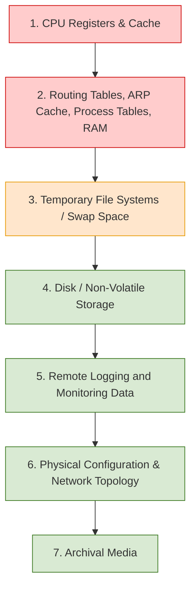
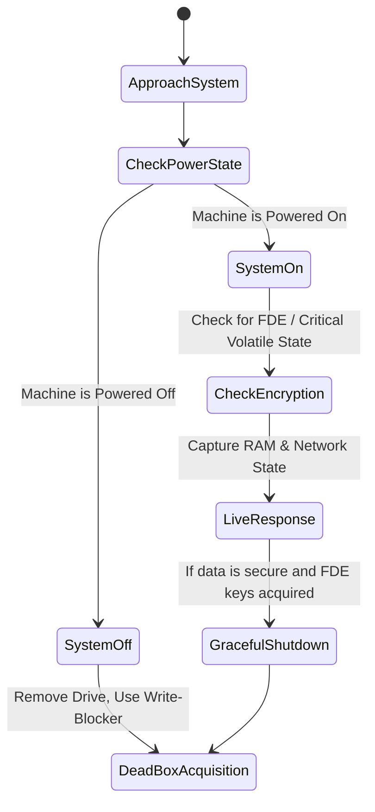

# Order of Volatility and Evidence Acquisition Types

## 1. Overview

In digital forensics, not all data persists equally. When a cybersecurity incident occurs, the investigator must prioritize the collection of evidence based on its expected lifespan. **RFC 3227 (Guidelines for Evidence Collection and Archiving)** defines the standard methodology for this prioritization, known as the **Order of Volatility (OoV)**.

This document details the Order of Volatility, explains the technical mechanisms behind volatile and non-volatile data, and breaks down the two primary methodologies for data extraction: **Live Response (Live Acquisition)** and **Dead-Box Acquisition**. Understanding these concepts is critical for preserving transient artifacts, such as active network connections and memory-resident malware, which are permanently destroyed if a system is improperly powered down.

## 2. Prerequisites

Before proceeding, the reader should understand:

* **Locard's Exchange Principle (`01-locards-exchange-principle.md`):** The axiom that every interaction leaves a trace, and importantly, that the investigator's actions during acquisition will inherently alter the target system (the Observer Effect).

## 3. Terminology

* **Volatile Data:** Data that requires a continuous power supply to maintain its state. If power is interrupted, the data is instantly and permanently lost.
* **Non-Volatile Data:** Data stored on media that retains its state without power (e.g., Hard Disk Drives, Solid State Drives, NVMe, USB flash drives).
* **Live System:** A computer, server, or device that is currently powered on and running its operating system.
* **Full Disk Encryption (FDE):** Cryptographic protection applied at the block level of a storage device (e.g., BitLocker, LUKS, FileVault). The decryption keys reside in volatile memory only while the system is running and unlocked.

## 4. The Order of Volatility (RFC 3227)

RFC 3227 is a Request for Comments published by the Internet Engineering Task Force (IETF) that outlines best practices for collecting digital evidence. The core directive is that evidence must be acquired moving from the most volatile to the least volatile.

### 4.1 The Sequence

According to RFC 3227, an investigator must collect data in the following strict order:

### 4.2 Why This Order Exists (Cause and Effect)

* **CPU Registers & Cache (L1/L2/L3):** These hold the exact instructions the processor is executing at a given nanosecond. They are continuously overwritten millions of times per second. *(Note: Collecting these is practically impossible in standard incident response and is generally reserved for specialized hardware debugging).*
* **Memory (RAM) & System Tables:** Random Access Memory holds running processes, injected code, active network sockets, decrypted passwords, and master encryption keys. If the system loses power, the RAM capacitor charge dissipates, and this data is lost.
* **Temporary File Systems / Swap Space:** Operating systems use disk space (like `pagefile.sys` in Windows or swap partitions in Linux) to offload inactive RAM pages. While stored on non-volatile disks, the OS dynamically overwrites this space during normal operation.
* **Disk:** Traditional storage media. Barring specific hardware functions like SSD TRIM or active wiping by an attacker, this data remains static when the system is powered off.

## 5. Live Response (Live Acquisition)

Live Response is the process of extracting volatile data, and sometimes targeted non-volatile data, while the suspect operating system remains powered on and operational.

### 5.1 How It Works

1. The investigator inserts a trusted external drive (e.g., a USB drive) into the suspect machine.
2. The drive contains statically compiled forensic tools (tools that do not require external shared libraries/DLLs from the suspect system).
3. The investigator executes a memory capture tool (e.g., `DumpIt`, `Belkasoft RAM Capturer`, `LiME` on Linux) to read the physical memory address space and write it to a dump file (`.raw` or `.mem`) on the external drive.
4. The investigator executes commands to capture system state (e.g., `netstat -ano` for network connections, `tasklist` for processes).

### 5.2 Dependencies and Assumptions

* **OS API Trust:** Live response fundamentally depends on the suspect operating system's Application Programming Interfaces (APIs). When a tool requests the process list, it asks the OS kernel to provide it.
* **Administrative Privileges:** Reading raw memory and low-level system tables requires root/SYSTEM or Administrator access.

### 5.3 Security Implications and Limitations

* **Rootkit Interference:** If the system is compromised by a kernel-level rootkit, the OS APIs cannot be trusted. The rootkit can intercept the forensic tool's API call and return a modified list that hides the malicious process or network connection.
* **The Observer Effect:** Executing any tool on a live system violates strict isolation.
* *Cause:* Running a forensic tool.
* *Effect:* The binary is loaded into RAM (overwriting existing unallocated RAM), execution artifacts (Prefetch, Shimcache) are created in the Windows Registry and file system, and Last Access timestamps on the disk may be altered.

## 6. Dead-Box Acquisition

Dead-Box Acquisition (also known as Post-Mortem or Static Acquisition) is the process of extracting non-volatile data from a storage medium after the suspect system has been powered down.

### 6.1 How It Works

1. The suspect machine is powered off.
2. The physical storage drive (HDD/SSD) is carefully removed from the machine.
3. The drive is connected to a **Hardware Write-Blocker** (detailed in `04-evidence-preservation-and-write-blocking.md`).
4. The write-blocker is connected to a dedicated Forensic Workstation.
5. Forensic imaging software creates a bit-for-bit, sector-by-sector duplicate of the drive.

### 6.2 Security Implications and Benefits

* **Absolute Integrity:** Because the host operating system is powered off, no background processes, scheduled tasks, or malware can execute or alter data. The write-blocker ensures zero bytes are written to the suspect drive.
* **Bypassing OS Restrictions:** By analyzing the disk externally, the investigator bypasses all OS-level file locking, permissions, and active rootkits. The analyst interacts directly with the raw file system (e.g., parsing the NTFS Master File Table directly).

## 7. The Decision Flow: Pulling the Plug vs. Live Capture

Historically, the standard procedure upon discovering a compromised machine was to literally "pull the plug" from the wall. This bypassed the OS's graceful shutdown routine, which alters thousands of files and deletes temporary data.

In modern environments, pulling the plug immediately is often a catastrophic error due to two factors: **Full Disk Encryption (FDE)** and **Fileless Malware**.

### 7.1 The Threat of Full Disk Encryption (FDE)

* **Cause:** A machine is protected by BitLocker (Windows) or LUKS (Linux).
* **Mechanism:** While the machine is on, the Volume Master Key is stored in plaintext in the RAM to encrypt/decrypt data on the fly.
* **Trigger (Pulling the Plug):** Power is lost. The RAM clears. The Volume Master Key is destroyed.
* **Result:** The investigator acquires a dead-box image of the drive, but it consists entirely of high-entropy, encrypted ciphertext. Without the recovery key, the evidence is inaccessible.
* **Mitigation:** A Live Response memory capture must be performed *before* power down. Forensic tools (like Volatility) can extract the FDE keys directly from the captured RAM.

### 7.2 Decision Workflow

> [!IMPORTANT]
> If a system is executing a destructive wiping process (e.g., active Ransomware encrypting files), the priority shifts immediately from evidence preservation to damage containment. In this specific scenario, pulling the plug is the correct action to halt the encryption process, sacrificing RAM analysis to save the remaining unencrypted data on the disk.

## 8. Enterprise and Cloud Considerations

The traditional concepts of Live vs. Dead-box acquisition change significantly depending on the environment.

### 8.1 Virtualized and Cloud Environments (AWS, Azure, ESXi)

You cannot physically remove a hard drive from an AWS data center.

* **Live Acquisition:** Involves running scripts (like AWS Systems Manager or Azure Runbooks) to capture memory or perform remote triage.
* **Dead-Box Equivalent:** Instead of physical write-blockers, the investigator triggers a hypervisor-level API call to snapshot the virtual disk (e.g., an EBS Snapshot). A new, isolated forensic virtual machine is spun up, and the read-only snapshot is attached to it for analysis.

### 8.2 Enterprise High-Availability Systems

In a corporate data center, shutting down a critical database server to perform a dead-box acquisition may cost the business millions of dollars in downtime.

* **Limitation:** Dead-box acquisition is often operationally prohibited.
* **Alternative:** Investigators rely heavily on Live Response, deploying agent-based forensic collection tools (e.g., Velociraptor, KAPE) to perform targeted logical acquisitions over the network while the server remains in production.

## 9. Summary of Trade-Offs

| Acquisition Type | Primary Target | Pro | Con |
| --- | --- | --- | --- |
| **Live Response** | RAM, Network, FDE Keys, Processes | Captures ephemeral threats (fileless malware) and encryption keys. | Modifies the system state; relies on potentially untrustworthy OS APIs. |
| **Dead-Box** | Hard Drives, SSDs, USBs | Cryptographically sound, perfectly preserves non-volatile data. | Destroys all volatile data; rendered useless by active FDE without keys. |