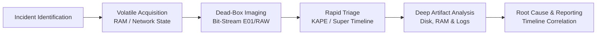

# 🔍 Digital Forensics & Incident Response (DFIR) Handbook

[](https://opensource.org/licenses/MIT)
[](#)
[](#curriculum-roadmap)
[](#)

A practical, low-level technical repository documenting digital forensic methodologies, operating system artifact analysis, memory inspection, and enterprise triage workflows. Designed as both an end-to-end curriculum and an active investigative reference manual.

---

## 🧭 Investigation Lifecycle



---

## 📚 Curriculum Roadmap

| Module | Focus Area | Key Concepts & Artifacts | Primary Tooling | Status |
| --- | --- | --- | --- | --- |
| **`01-fundamentals-and-acquisition`** | Evidence Acquisition | Order of Volatility, RFC 3227, Chain of Custody, Write-blocking | `dc3dd`, `FTK Imager`, `ewfmount` | [ ] |
| **`02-file-systems-analysis`** | File System Internals | NTFS $MFT,$LogFile, Timestamps (SI vs. FN), ext4 inodes | `The Sleuth Kit (TSK)`, `MFTECmd` | [ ] |
| **`03-windows-execution-artifacts`** | Program Execution | Prefetch (`.pf`), Shimcache, Amcache, UserAssist, BAM/DAM | `PECmd`, `AppCompatCacheParser` | [ ] |
| **`04-windows-persistence-and-registry`** | Persistence & User Data | Shellbags, LNK, Jump Lists, USB tracking, Run keys, Tasks | `SBECmd`, `LECmd`, `Registry Explorer` | [ ] |
| **`05-event-logs-and-timeline-analysis`** | Detection & Super Timelines | EVTX structure, Logon Types (4624/4625), Sysmon, Super Timelines | `EvtxECmd`, `Hayabusa`, `Plaso` | [ ] |
| **`06-memory-forensics`** | RAM & Process Triage | Virtual memory, code injection (malfind), rootkits, handle tables | `Volatility 3`, `MemProcFS`, `WinPmem` | [ ] |
| **`07-network-forensics`** | Network & Traffic Analysis | Packet triage, DNS exfiltration, C2 beacons, SMB lateral movement | `Wireshark`, `TShark`, `Zeek`, `Zui` | [ ] |
| **`08-linux-and-unix-forensics`** | Linux Endpoint Forensics | `/proc` subsystem, auth logs, bash history, auditd, cron persistence | `UAC`, `ausearch`, `Volatility 3` | [ ] |
| **`09-anti-forensics-and-detection`** | Evasion & Tampering | Timestomping, Volume Shadow Deletion, Event log clearing | `USN Journal Parser`, `VSSAdmin` | [ ] |
| **`10-enterprise-triage-and-reporting`** | Enterprise Triage & Labs | Target-based triage, VQL queries, case scenarios, reporting | `KAPE`, `Velociraptor` | [ ] |

---

## 🗂️ Repository Structure

```text
.
├── 01-fundamentals-and-acquisition/
│   └── in development...
├── 02-file-systems-analysis/
│   └── coming soon...
├── 03-windows-execution-artifacts/
│   └── coming soon...
├── 04-windows-persistence-and-registry/
│   └── coming soon...
├── 05-event-logs-and-timeline-analysis/
│   └── coming soon...
├── 06-memory-forensics/
│   └── coming soon...
├── 07-network-forensics/
│   └── coming soon...
├── 08-linux-and-unix-forensics/
│   └── coming soon...
├── 09-anti-forensics-and-detection/
│   └── coming soon...
├── 10-enterprise-triage-and-reporting/
│   └── coming soon...
└── README.md
```

---

## 🛠️ Analysis Environment & Prerequisites

> [!IMPORTANT]
> Always conduct forensic artifact parsing inside an isolated analysis virtual machine (Flare-VM or REMnux). Never mount unverified forensic images directly to your host operating system.

### Recommended Lab Workstations

* **Windows Host (Flare-VM):** Windows 10/11 enterprise evaluation machine configured with the [Mandiant Flare-VM](https://github.com/mandiant/flare-vm) package and [Eric Zimmerman's Tools](https://ericzimmerman.github.io).
* **Linux Host (REMnux):** Ubuntu-based distribution pre-configured for reverse engineering and memory triage.

---

## 📖 Primary References & Standards

* **RFC 3227:** Guidelines for Evidence Collection and Archiving.
* **NIST SP 800-86:** Guide to Integrating Forensic Techniques into Incident Response.
* **SANS DFIR Posters:** Windows Forensic Analysis & Memory Analysis Cheat Sheets.
* **13Cubed:** Technical training lectures and digital forensic deep-dives.

---

## 📄 License

This repository is distributed under the terms of the [MIT License](https://opensource.org/licenses/MIT).
